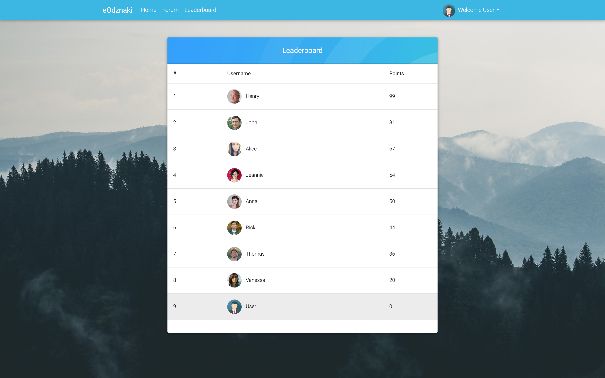

# eOdznaki

### About project

A single page application made with Angular and ASP.NET Core as the backend. It allows users to save their favourite trails and share their hiking experiences on the forum.

### Technology

ASP.NET Core 2.2.3

- AutoMapper
- CloudinaryDotNet
- AspNetCore.Identity
- EntityFrameworkCore.SqlServer

Angular 6.0.8

- agm/core
- angular-jwt
- time-ago-pipe
- ng2-file-upload
- angular-bootstrap-md

### Screenshots

Register:

Profile Edit:

Avatar Upload:

Trail Saving:

Forum:

Leaderboard:

